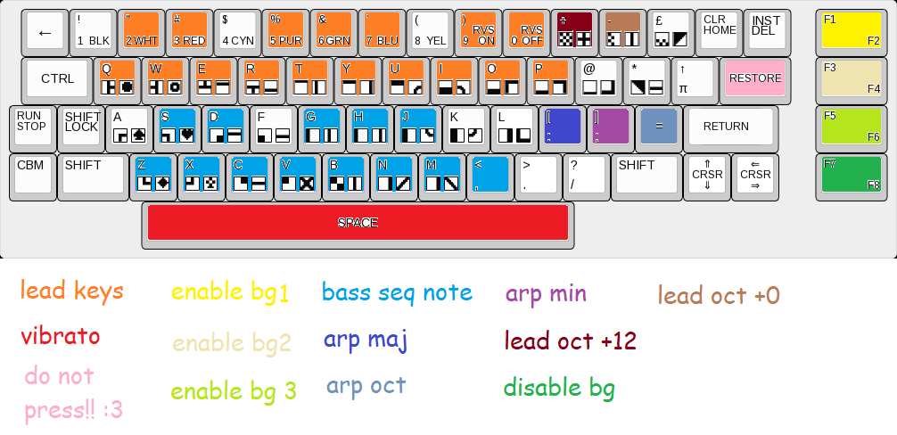

# vitar
A Commodore VIC-20 Keytar for Chaos Communication Camp 2023 released at Ontrack Demoparty

Works on stock unexpanded Commodore VIC-20 machines (5KB RAM)

Here is the current keyboard layout for playing, made in glorious microsoft paint:

As you can see, do not press restore, as it disables interrupts for about 5 seconds and stops the background player, I do not know why it does this or how to fix this nor do I have plans to fix it, so just don't press it :3

The entire program timing is reliant on byte $A2 in the zeropage ticking up and then copying and dividing it for various timers, which is incremented every frame using some interrupt that I don't know where it comes from

As of writing, I can barely play my own instrument, but I hope someone else can better than I do, and as it can run on stock VIC-20 hardware, you have no excuse!!

It is assembled with the [MOS Assembler](https://github.com/datatrash/mos) and included is a batch file (probably easily convertible to a shell script if you're on linux!) that assembles it (If that's even something you wish to do with this awful, terrible code)
